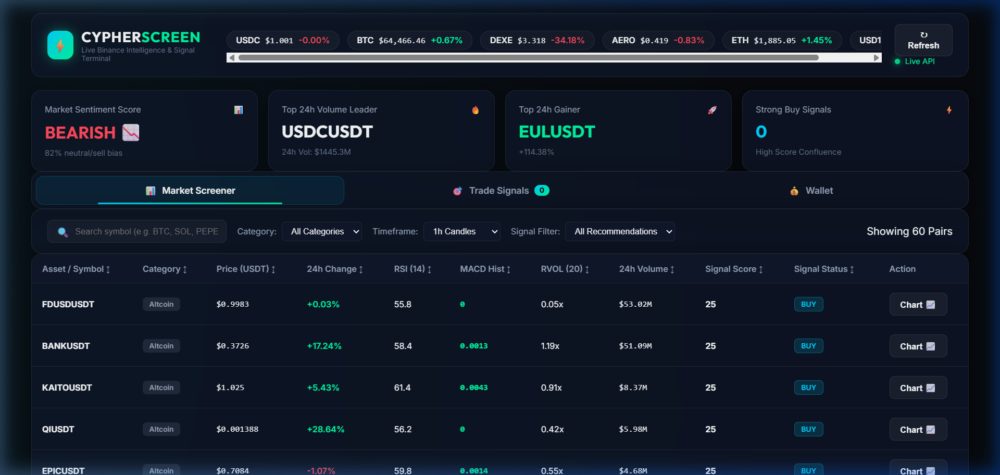
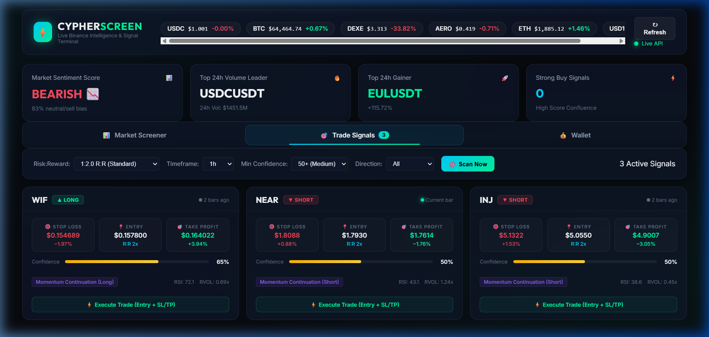
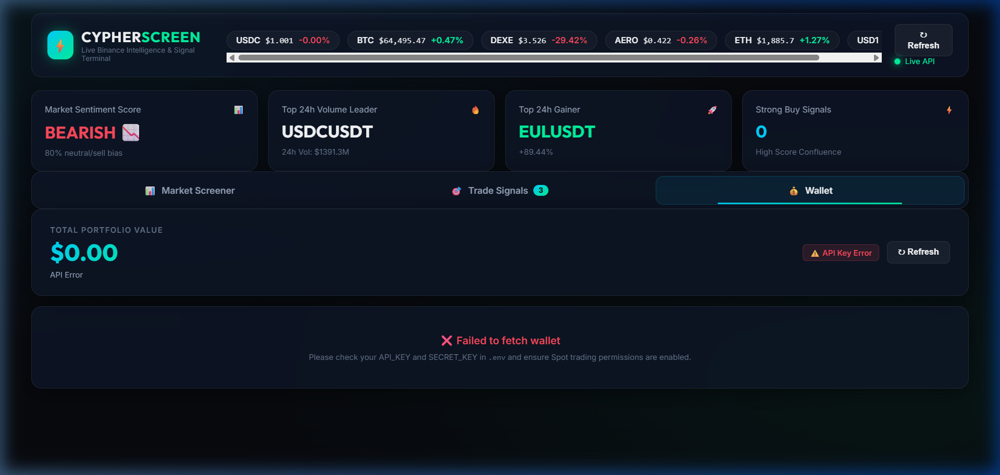
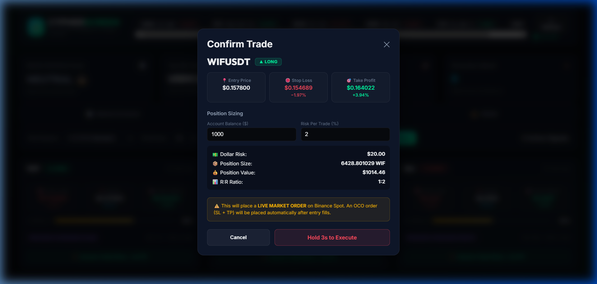

# Binance Live Crypto Analysis & Screener

> A high-performance, real-time Cryptocurrency Market Screener and Technical Analysis platform powered by the Binance REST API. Features parallel multi-factor pair screening, vectorized technical indicators, signal scoring, an interactive web dashboard, and dedicated Jupyter notebooks for exploratory data analysis.

---

## Key Features

1. **Secure Credential Management**:
   - Strictly git-ignored `.env` file for private `API_KEY` and `SECRET_KEY`.
   - `.env.example` template for public repository deployment without secret leaks.

2. **Real-Time Technical Analysis Engine**:
   - **RSI (14)**: Relative Strength Index oversold (<30) and overbought (>70) detection.
   - **MACD (12, 26, 9)**: Bullish & Bearish signal line crossover tracking.
   - **EMA Stack (9, 21, 50, 200)**: Trend direction stack & Golden Cross identification.
   - **Bollinger Bands (20, 2)**: Bandwidth percentage calculation and volatility compression.
   - **RVOL (Relative Volume)**: Volume spike detection vs 20-period moving average.
   - **ATR (14)**: Average True Range calculation for dynamic Stop Loss & Take Profit targets.

3. **Multi-Factor Crypto Screener**:
   - Parallel multi-threaded scanning across Binance USDT pairs.
   - Composite Signal Scoring model (-100 to +100) categorizing pairs into **STRONG BUY**, **BUY**, **NEUTRAL**, **SELL**, or **STRONG SELL**.
   - Sector/Category filters (Layer 1, AI / Data, DeFi, Meme, Layer 2).

4. **Interactive Web Dashboard & Live Trading Terminal**:
   - Glassmorphic dark trading UI built with vanilla HTML/CSS/JS.
   - **Trade Signals Terminal**: 1-click execution for algorithmic trade setups, generating OCO (Stop Loss + Take Profit) orders dynamically.
   - **Live Wallet Integration**: Real-time Binance spot balances, 24-hour asset changes, and aggregate portfolio value calculation.
   - Canvas-based candlestick charting modal with EMA overlays and interactive risk position calculator.
   
   
   
   
   
   
   
   

5. **Interactive Jupyter Notebooks**:
   - `01_binance_data_exploration.ipynb`: Market summary, 24-hour volume leaders, and candlestick ingestion.
   - `02_indicator_deep_dive.ipynb`: Multi-indicator plotting with Plotly dark themes.
   - `03_screener_backtest.ipynb`: Backtesting technical signal rules against historical klines.
   - `04_strategy_backtest_comparison.ipynb`: 20-strategy comparison with win rate, Sharpe ratio, equity curves, and composite ranking.
   - `05_multi_timeframe_analysis.ipynb`: Multi-timeframe (5m/15m/1h/4h) 20-strategy comparison plus Crypto vs Gold (XAUTUSDT, PAXGUSDT) analysis.
   - `06_atr_risk_management_backtest.ipynb`: Bar-by-bar ATR Stop-Loss & Take-Profit simulator testing 1:1.5, 1:2.0, and 1:3.0 Risk-to-Reward ratios and account equity growth ($1,000 capital, 2% risk/trade).

---

## Repository Structure

```
crypto-analysis/
├── .env                               # Private API credentials (GIT IGNORED)
├── .env.example                       # Safe environment variable template
├── .gitignore                         # Standard exclusion rules
├── README.md                          # Documentation & project guide
├── requirements.txt                   # Dependencies (FastAPI, Pandas, Jupyter, Plotly)
├── assets/
│   └── screenshots/                   # UI documentation screenshots
├── notebooks/                         # Jupyter Notebooks for analysis
│   ├── 01_binance_data_exploration.ipynb
│   ├── 02_indicator_deep_dive.ipynb
│   ├── 03_screener_backtest.ipynb
│   ├── 04_strategy_backtest_comparison.ipynb
│   ├── 05_multi_timeframe_analysis.ipynb
│   └── 06_atr_risk_management_backtest.ipynb
├── backend/
│   ├── config.py                      # Environment configuration loader
│   ├── binance_client.py              # REST API client with failover endpoints
│   ├── indicators.py                  # Vectorized Technical Indicators Engine
│   ├── screener.py                    # Multi-pair Screener & Signal Scoring
│   └── app.py                         # FastAPI Web Server & Static File Host
└── frontend/
    ├── index.html                     # Web Dashboard layout
    ├── css/
    │   └── styles.css                 # Dark mode glassmorphic CSS theme
    └── js/
        ├── api.js                     # API communications client
        ├── chart.js                   # Canvas candlestick charting renderer
        └── app.js                     # Interactive table UI & position calculator
```

---

## Quick Start Guide

### 1. Prerequisites
Ensure you have **Python 3.10+** installed.

### 2. Configure Environment Variables
Copy `.env.example` to `.env` and enter your Binance API Key and Secret:
```bash
cp .env.example .env
```
*(Your `.env` file is protected by `.gitignore` and will never be committed to Git.)*

### 3. Install Dependencies
Install required packages using `pip`:
```bash
pip install -r requirements.txt
```

### 4. Run the Screener Server & Web Dashboard
Launch the FastAPI server with Uvicorn:
```bash
python -m uvicorn backend.app:app --host 127.0.0.1 --port 8000
```
Open your browser and navigate to the static dashboard:
**`http://127.0.0.1:8000/static/index.html`**

---

## Using Jupyter Notebooks

Launch Jupyter Notebook to perform custom research and backtesting:
```bash
jupyter notebook
```
Navigate to the `notebooks/` directory and open any of the notebooks:
- **`01_binance_data_exploration.ipynb`**: Fetch 24-hour market metrics & ticker statistics.
- **`02_indicator_deep_dive.ipynb`**: Plot RSI, MACD, and EMA charts interactively.
- **`03_screener_backtest.ipynb`**: Test technical signal win-rates against historical candles.
- **`04_strategy_backtest_comparison.ipynb`**: Full 20-strategy backtest comparison with performance metrics, heatmaps, and equity curves.
- **`05_multi_timeframe_analysis.ipynb`**: Multi-timeframe (5m/15m/1h/4h) analysis and Crypto vs Gold comparison.
- **`06_atr_risk_management_backtest.ipynb`**: Dynamic ATR Stop-Loss / Take-Profit backtester with account equity growth simulation.

---

## Security Best Practices

- **Never hardcode API Keys**: Always read credentials from `.env` via `backend/config.py`.
- **Binance API Key Permissions**: For read-only screening, enable **only Read Info / Market Data** permissions on Binance. Disable Withdrawal permissions on your API key.
- **Git Verification**: Run `git status` before committing to confirm `.env` is un-tracked.

---

## License
This project is open source and available under the [MIT License](LICENSE).
